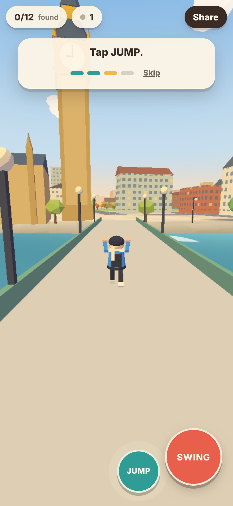

**Play:** https://therealsiyuan.github.io/citywalk/  ← live once this repo is pushed and Pages is enabled (see [Deploy](#deploy); it has not been published yet)

# CityWalk — London

Walk, run, jump and swing through a storybook central London in your phone's
browser. Find all twelve landmarks and learn a fact at each. Send the link to
a friend and they appear next to you.

No menu, no login, no install, no backend, and no art/audio files: every
building, character, shader and sound is generated in code.



## Controls

| | Touch | Desktop |
|---|---|---|
| Move | Drag anywhere on the **left** half (push far = run) | `WASD` / arrows (`Shift` = walk) |
| Look | Drag the **right** half | Click to capture the mouse, then move it |
| Jump | **Jump** button | `Space` |
| Swing | **Hold Swing**, release to fly | Hold left click, or hold `E` |

- A diamond marks the anchor Swing would grab. You don't need to aim: it picks
  the best rooftop, crane, mast or lamppost ahead of and above you.
- Push the stick while swinging to pump. Jump mid-swing to kick off upward.
- Leave the camera alone and it trails your direction of travel, so one thumb
  on the stick plus one on Swing is enough.
- Fall in the Thames and you are put back on the nearest bank.
- Tap **0/12 found** for the journal, your name tag, sound, and to replay the tutorial.
- **Share** opens the native share sheet (or copies the link). Anyone opening
  it joins your room, up to 8 players.

## Run it

```bash
npm install
npm run dev        # http://localhost:5173
npm run build      # type-check (zero errors required) + production build into dist/
npm test           # unit tests: swing physics, London layout, traversal bot
npm run e2e        # Playwright: phone viewport + two-player test (needs `npm run build` first)
```

`npm run e2e` starts the preview server and a tiny local signalling relay
itself. On a machine where Playwright's Chromium is not installed, run
`npx playwright install chromium` once.

## Retune traversal

Every feel value is in **`src/config.ts`** — gravity, walk/run speed, jump,
air control, rope length, reel speed, auto-aim cone, pump strength, camera.
With `npm run dev` running, edit and save: the game hot-reloads.

| To make it… | Change |
|---|---|
| floatier / heavier | `gravity` |
| faster on foot | `runSpeed`, `walkSpeed`, `runThreshold` |
| longer, lazier swings | `swing.maxRope`, `swing.idealDist` ↑ |
| easier to grab anchors | `swing.aimConeDot` ↓ (−1 = any direction) |
| more launch when you attach | `swing.reelPull`, `swing.attachHop` ↑ |
| swing higher off the ground | `swing.groundClearance` ↑ |
| a "heavier" pendulum | `swing.damping` > 0 |
| faster top speed | `maxSpeed` |

The physics itself is in `src/physics/swing.ts` (pure functions, no
rendering) and is what `tests/swing.test.ts` checks: energy conservation,
pendulum period, rope length, and that release keeps velocity exactly.
`tests/traversal.test.ts` then drives the real controller through the real
city with a no-skill bot to check a beginner chains swings.

## How it is built

- **Three.js + Vite + TypeScript**, static site. JS is ~182 kB gzipped (budget: 2 MB).
- **Rendering:** about 16 draw calls and ~180k triangles for the whole city. One
  hand-written cel shader (three light bands, warm light / cool shade, fog
  into a gradient sky), instanced buildings/trees/lamps, all landmarks merged
  into one mesh. No real-time shadows. Pixel ratio is capped at 1.5 and
  drops automatically if the frame rate falls below ~45 fps.
- **London:** real lat/lon projected onto a ~1.6 km × 1 km map (x east, z
  south), Thames as a smoothed spline through the real bridge positions.
  `tests/world.test.ts` checks which bank each landmark is on and their order.
- **Multiplayer:** [Trystero](https://github.com/dmotz/trystero) (Nostr
  strategy) for serverless peer discovery, then WebRTC data channels.
  Position, facing, animation state and rope anchor go out 12 times a second
  as a 40-byte packet and are interpolated 160 ms in the past.
- **Deploy:** `.github/workflows/deploy.yml` builds, runs unit tests, and
  publishes `dist/` to GitHub Pages on every push to `main`.

## Deploy

The repo is ready but has not been pushed (the build session had no GitHub
credentials for a new repository). From this folder:

```bash
gh repo create citywalk --public --source=. --remote=origin --push
gh api -X POST repos/{owner}/citywalk/pages -f build_type=workflow   # Pages source = GitHub Actions
gh workflow run "Build, test and deploy to GitHub Pages"             # or just push again
```

The URL will be `https://<your-github-username>.github.io/citywalk/`. If you
use a different repo name, the URL changes with it (nothing in the build
depends on the path). A **private** repo only gets Pages on a paid GitHub plan.

## Choices made without asking

- **Trystero over PeerJS:** mesh rather than host-and-spoke (the room
  survives the first player leaving) and several redundant public relays
  rather than PeerJS's single public broker.
- **Spawn** is the east end of Westminster Bridge facing Big Ben, so the
  first frame is recognisably London; County Hall beside you gives the first
  swing somewhere to go.
- **Bridges are flat and at street level** so you can never get stuck on a ramp.
- **Lamps on bridges are not anchors** (a swing from one only ends in the
  river); embankment lampposts, bridge masts/towers, cranes and rooftops are.
- **Attaching redirects your speed along the rope** instead of losing it —
  less realistic than a real rope jerk, far more forgiving.
- **Scale:** horizontal distances are ~0.28× real; landmark heights are
  roughly 0.5× so silhouettes read from across the map.
- **Facts** are limited to well-established ones (see `src/world/data.ts`).
- `?relay=wss://…` uses your own signalling relay instead of the public ones;
  `?solo=1` turns networking off (as does building with `VITE_SOLO=1`, which
  also hides Share, for hosts that block WebRTC).

## Known gaps

- **Not yet tested on a physical phone.** Everything was verified in headless
  Chromium at 390×844 with touch emulation and software rendering, which says
  nothing reliable about real frame rate. The 60/30 fps target is designed
  for (draw calls, shader cost, dynamic resolution) but unmeasured on hardware.
- **Multiplayer over the public internet is unverified.** The two-player test
  uses the real Trystero + WebRTC path but a local relay, because the build
  environment could not reach public relays. Expect it to work on normal
  Wi-Fi/4G; players behind strict (symmetric) NATs may fail to connect since
  there is no TURN server — in that case each simply plays solo.
- Peers took ~8 s to connect in testing (with STUN unreachable); it should be
  quicker on a real network but that is unmeasured.
- The 8-player cap is enforced client-side (extra peers are ignored), since
  there is no server to refuse them.
- Rope has no line-of-sight check and can pass through buildings; you collide
  with walls but the rope does not wrap.
- Trees are scenery only (no collision). The London Eye's wheel turns but its
  anchors and capsules are not ridable.
- iOS Safari, pointer-lock mouse look, and the native share sheet are written
  to spec but were not exercised by the automated tests.
- Sound is a few synthesised blips and wind; no music.
